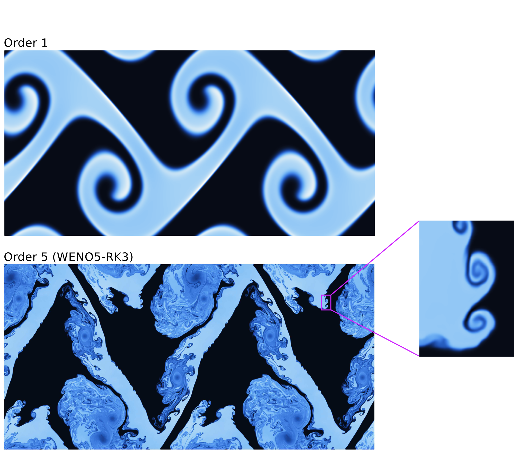

# Numerical simulation of complex flows

Nowadays, the combination of modern supercomputers with cutting-edge simulation tools allows to solve very complex problems of technological and scientific interest and, what is more important, it allows to be predictive. The numerical simulation of environmental events, such as atmospheric, oceanic or surface water flows, has come to a point where trustworthy predictions can be done at an affordable cost, providing quite a realistic picture of the potential threats linked to those events. On the other hand, the rocketing technological growth of the manufacturing industry is demanding the study and resolution of new problems that can be addressed through the same approach.

## Hyperbolic conservation laws

Hyperbolic partial differential equations arise in a broad variety of fields where wave propagation phenomena are dominant, for instance, gas dynamics and acoustics, and there is a branch of CFD that is exclusively focused on such problems. Historically, many of the fundamental ideas were developed in the framework of the compressible Euler equations for gas dynamics by the aerospace community. At present, these methods have been extended to other applications such as free surface flows modeled by the shallow water equations (SWE). As Euler equations, the SWE are nonlinear and their solutions suffer from loss of regularity: solutions that are initially smooth may eventually become discontinuous in the form of shock waves.

## State-of-the-art challenges

Nowadays, the current trend is to design accurate and efficient schemes by means of a combination of: (a) very high order numerical schemes (e.g. WENO, ENO, DG reconstructions with ADER and RK integrators), which require a shorter computational time and memory than a lower order scheme to achieve the same accuracy (see Figures 1, 2 and 3), (b) adaptive mesh refinement techniques and other sophisticated meshing algorithms and (c) efficient parallel implementations for high performance computing (OpenMP, MPI, CUDA and OpenACC, among others).

<figure style="text-align: center;">
  
  <figcaption>Figure 1. Numerical solution of the Doswell frontogenesis for the linear advection equation using a 1-st order and 7-th order WENO-ADER scheme.</figcaption>
</figure>

<figure style="text-align: center;">
  
  <figcaption>Figure 2. Numerical solution of a Kelvin-Helmholtz instability for Euler equations using a 1-st order and 5-th order WENO-RK scheme.</figcaption>
</figure>

<figure style="text-align: center;">
  
  <figcaption>Figure 3. Logarithmic plot of the numerical error versus the number of cells (left) and CPU time (right) for the resolution of the acoustic equations using the WENO-ADER scheme.</figcaption>
</figure>

On the other hand, the presence of source terms in the equations is an issue which we must pay attention to. Source terms model the presence of extra physical effects not represented by the pure conservative terms in the equations and may often govern the dynamics of the problem. The search of a suitable treatment of the source term in the numerical scheme is not a trivial task, but it is of utmost importance in order to preserve steady states of relevance.

## Research lines

- [Accurate simulation of free surface shallow flows](swe_thesis.md) (results of my PhD thesis)

- [Evaluation of the spectral properties of numerical schemes](test.md)

- [Computational hemodynamics](test.md)

- [Augmented resolution of non-conservative systems and hyperbolized problems](test.md)

## Contact

For more information, please contact me: anavas [at] unizar.es
