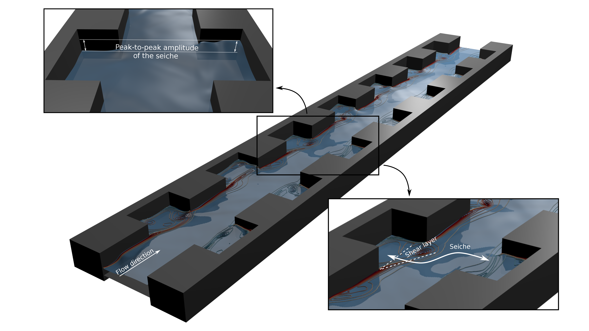

# Numerical simulation of environmental flows

## Short bio

I am Assistant professor in the Department of Science and Technology of Materials and Fluids at the Polytechnical School of Teruel (University of Zaraogoza). My on-going and future research focuses on the development of efficient simulation tools for environmental flows.   

## Teaching

- [Fluid Mechanics](teaching/fluidos.md) (2021-present), at University of Zaragoza
- Thermodynamics and heat transfer (2021-present), at University of Zaragoza
- Solid mechanics (2019-2021), at Centro Universitario de la Defensa

## Research lines

Nowadays, the combination of modern supercomputers with cutting-edge simulation tools allows to solve very complex problems of technological and scientific interest and, what is more important, it allows to be predictive. The numerical simulation of environmental events, such as atmospheric, oceanic or surface water flows, has come to a point where trustworthy predictions can be done at an affordable cost, providing quite a realistic picture of the potential threats linked to those events. On the other hand, the rocketing technological growth of the manufacturing industry is demanding the study and resolution of new problems that can be addressed through the same approach.

The current trend is to design accurate and efficient schemes by means of a combination of: (a) very high order numerical schemes (e.g. WENO, ENO, DG reconstructions with ADER and RK integrators), which are more efficient than low order schemes (see Fig. 1), (b) adaptive mesh refinement techniques and other sophisticated meshing algorithms, (c) efficient parallel implementations for high performance computing (OpenMP, MPI, CUDA and OpenACC, among others) and (d) machine learning and big-data approaches. 

<figure style="text-align: center;">
  
  <figcaption>Figure 1. Numerical simulation of a channel with lateral cavities with a 3-rd order WENO-ADER shallow water model.</figcaption>
</figure>

- [Accurate simulation of free surface shallow flows](swe_thesis.md) 

- [Simulation of resonant flows in cavities](test.md)

- [Overcoming numerical shockwave anomalies](anomalies.md) 

- [Evaluation of the spectral properties of numerical schemes](test.md)

- [Computational hemodynamics](hemodynamics.md)

- [Hyperbolic hydrology](test.md)

## Contact

For more information, please contact me: anavas [at] unizar.es
