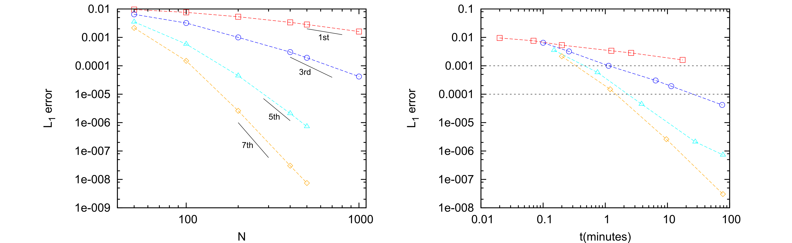

## Numerical simulation of complex flows

Nowadays, the combination of modern supercomputers with cutting-edge simulation tools allows to solve very complex problems of technological and scientific interest and, what is more important, it allows to be predictive. The numerical simulation of environmental events, such as atmospheric, oceanic or surface water flows, has come to a point where trustworthy predictions can be done at an affordable cost, providing quite a realistic picture of the potential threats linked to those events. On the other hand, the rocketing technological growth of the manufacturing industry is demanding the study and resolution of new problems that can be addressed through the same approach.

### Hyperbolic conservation laws

Hyperbolic partial differential equations arise in a broad variety of fields where wave propagation phenomena are dominant, for instance, gas dynamics and acoustics, and there is a branch of CFD that is exclusively focused on such problems. Historically, many of the fundamental ideas were developed in the framework of the compressible Euler equations for gas dynamics by the aerospace community. At present, these methods have been extended to other applications such as free surface flows modeled by the shallow water equations (SWE). As Euler equations, the SWE are nonlinear and their solutions suffer from loss of regularity: solutions that are initially smooth may eventually become discontinuous in the form of shock waves.

### State-of-the-art challenges

Nowadays, the current trend is to design accurate and efficient schemes by means of a combination of: (a) very high order numerical schemes (e.g. WENO, ADER and DG schemes), which require a shorter computational time and memory than a lower order scheme to achieve the same accuracy (see Figures 1 and 2), (b) adaptive mesh refinement techniques and other sophisticated meshing algorithms and (c) efficient parallel implementations for high performance computing (OpenMP, MPI, CUDA and OpenACC, among others).

<figure style="text-align: center;">
  
  <figcaption>Figure 1. Numerical solution of the Doswell frontogenesis for the linear advection equation using a 1-st order and 7-th order WENO-ADER scheme.</figcaption>
</figure>

<figure style="text-align: center;">
  
  <figcaption>Figure 2. Logarithmic plot of the numerical error versus the number of cells (left) and CPU time (right) for the resolution of the acoustic equations using the WENO-ADER scheme.</figcaption>
</figure>

On the other hand, the presence of source terms in the equations is an issue which we must pay attention to. Source terms model the presence of extra physical effects not represented by the pure conservative terms in the equations and may often govern the dynamics of the problem. The search of a suitable treatment of the source term in the numerical scheme is not a trivial task, but it is of utmost importance in order to preserve steady states of relevance.

## Research project

### Generation of arbitrary order augmented schemes for hyperbolic problems with source terms

We aim at the generation of fully-discrete arbitrary order numerical schemes, based on the WENO spatial reconstruction and ADER time-stepping technique, with application to hyperbolic problems with source terms. The proposed schemes are based on augmented Riemann solvers that include the contribution of source terms in the definition of the Riemann problem, allowing the presevation of equilibrium states with machine precision.

#### The WENO AR/ARL-ADER method in 1D: well-balanced and energy-balanced simulation of the SWE with bed variation

#### The WENO ARL-ADER method in 2D: well-balanced simulation of the SWE with bed variation, friction and Coriolis

[](https://www.youtube.com/watch?v=3SAfCJ6xGqY "play video")

[](https://www.youtube.com/watch?v=-Dye0LG8-Ds "play video")

[](https://www.youtube.com/watch?v=M7ep81gngow "play video")

#### URANS simulation of shallow flows using the WENO ARL-ADER method for the SWE

### Overcoming numerical shockwave anomalies

### Markdown

Here it is an example of how to add a link to a video:

[](https://www.youtube.com/watch?v=M7ep81gngow "video name")

Markdown is a lightweight and easy-to-use syntax for styling your writing. It includes conventions for

```markdown
Syntax highlighted code block

# Header 1
## Header 2
### Header 3

- Bulleted
- List

1. Numbered
2. List


**Bold** and _Italic_ and `Code` text

[Link](url) and 
```

For more details see [GitHub Flavored Markdown](https://guides.github.com/features/mastering-markdown/).

* [Hyperlink](test.md)

### Jekyll Themes

Your Pages site will use the layout and styles from the Jekyll theme you have selected in your [repository settings](https://github.com/navasmontilla/site/settings). The name of this theme is saved in the Jekyll `_config.yml` configuration file.

### Support or Contact

Having trouble with Pages? Check out our [documentation](https://help.github.com/categories/github-pages-basics/) or [contact support](https://github.com/contact) and we’ll help you sort it out.
