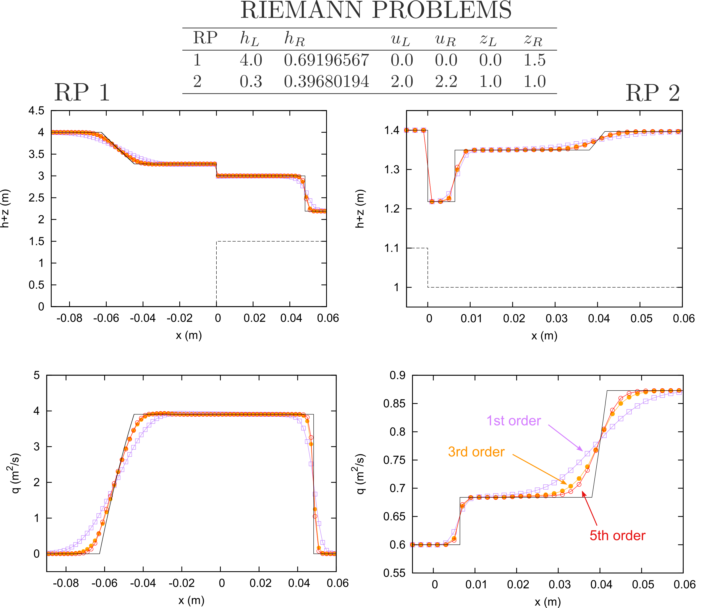
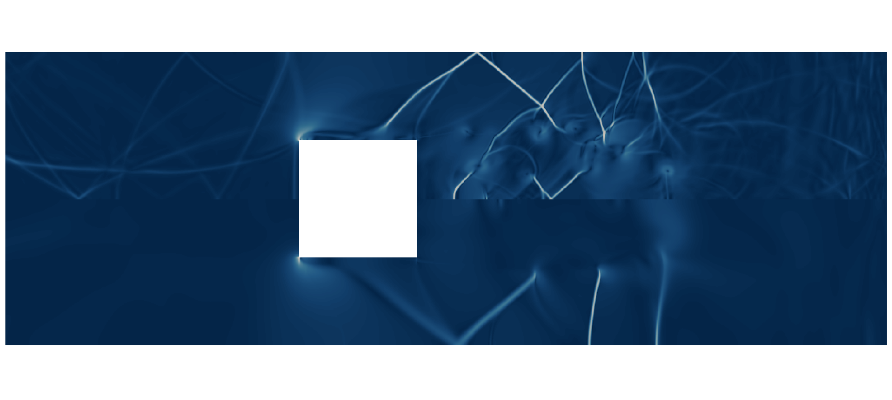
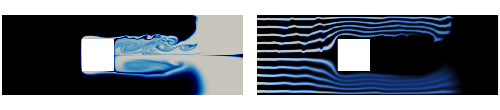
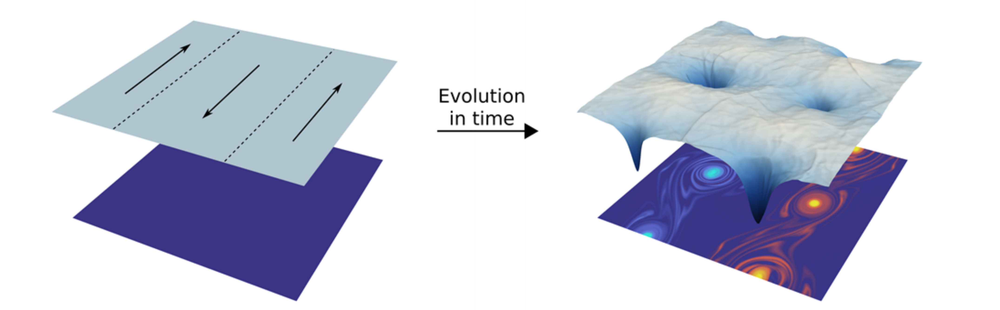
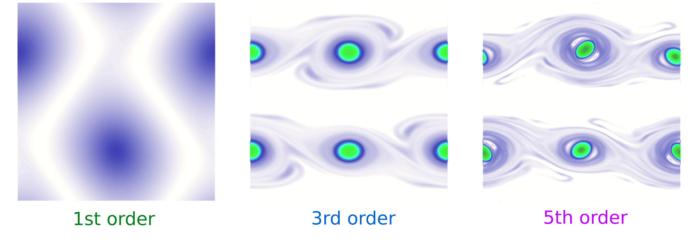

## Numerical simulation of complex flows

Nowadays, the combination of modern supercomputers with cutting-edge simulation tools allows to solve very complex problems of technological and scientific interest and, what is more important, it allows to be predictive. The numerical simulation of environmental events, such as atmospheric, oceanic or surface water flows, has come to a point where trustworthy predictions can be done at an affordable cost, providing quite a realistic picture of the potential threats linked to those events. On the other hand, the rocketing technological growth of the manufacturing industry is demanding the study and resolution of new problems that can be addressed through the same approach.

### Hyperbolic conservation laws

Hyperbolic partial differential equations arise in a broad variety of fields where wave propagation phenomena are dominant, for instance, gas dynamics and acoustics, and there is a branch of CFD that is exclusively focused on such problems. Historically, many of the fundamental ideas were developed in the framework of the compressible Euler equations for gas dynamics by the aerospace community. At present, these methods have been extended to other applications such as free surface flows modeled by the shallow water equations (SWE). As Euler equations, the SWE are nonlinear and their solutions suffer from loss of regularity: solutions that are initially smooth may eventually become discontinuous in the form of shock waves.

### State-of-the-art challenges

Nowadays, the current trend is to design accurate and efficient schemes by means of a combination of: (a) very high order numerical schemes (e.g. WENO, ADER and DG schemes), which require a shorter computational time and memory than a lower order scheme to achieve the same accuracy (see Figures 1 and 2), (b) adaptive mesh refinement techniques and other sophisticated meshing algorithms and (c) efficient parallel implementations for high performance computing (OpenMP, MPI, CUDA and OpenACC, among others).

<figure style="text-align: center;">
  
  <figcaption>Figure 1. Numerical solution of the Doswell frontogenesis for the linear advection equation using a 1-st order and 7-th order WENO-ADER scheme.</figcaption>
</figure>

<figure style="text-align: center;">
  
  <figcaption>Figure 2. Logarithmic plot of the numerical error versus the number of cells (left) and CPU time (right) for the resolution of the acoustic equations using the WENO-ADER scheme.</figcaption>
</figure>

On the other hand, the presence of source terms in the equations is an issue which we must pay attention to. Source terms model the presence of extra physical effects not represented by the pure conservative terms in the equations and may often govern the dynamics of the problem. The search of a suitable treatment of the source term in the numerical scheme is not a trivial task, but it is of utmost importance in order to preserve steady states of relevance.

## Research project

The work herein presented has been developed at the [Computational Hydraulics Group](http://ghc.unizar.es) at [Univerisity of Zaragoza](https://www.unizar.es/). Computational resources have been provided by [LIFTEC-CSIC](http://www.liftec.unizar-csic.es/es/). The validation of the computational tools has been done in colaboration with the [LCH-EPFL](https://lch.epfl.ch/).

This work is the result of my Doctoral Thesis [Accurate simulation of shallow flows using arbitrary order ADER schemes and overcoming numerical shockwave anomalies](https://zaguan.unizar.es/record/70795?ln=en), supervised by Dr. J. Murillo and presented at University of Zaragoza on the 27th April 2018. In the following sections, the most relevant aspects of this thesis are brought out and suplimentary multimedia content is presented.

### Generation of arbitrary order augmented schemes for hyperbolic problems with source terms: application to the SWE

We aim at the generation of fully-discrete arbitrary order numerical schemes, based on the WENO spatial reconstruction and ADER time-stepping technique, with application to hyperbolic problems with source terms. The proposed schemes are based on augmented Riemann solvers that include the contribution of source terms in the definition of the Riemann problem, allowing the presevation of equilibrium states with machine precision.

We consider the application of the aforementioned methods to the SWE with bed elevation, friction and Coriolis. In presence of such sources, the relevant equilibrium states are (see Figure 3):

- Quiescent equilibrium (well-balanced property).
- Moving water equilibrium (energy-balanced property).
- Geostrophic equilibrium (well-balanced property in the rotating frame).

<figure style="text-align: center;">
  
  <figcaption>Figure 3. Relevant equilibrium states for the SWE.</figcaption>
</figure>

Furthermore, additional dissipation effects are accounted for by including turbulence models using the Boussinesq approximation. The RANS and URANS approaches are considered and algebraic as well as 1 and 2 equation turbulence models are used.

#### The WENO AR/ARL-ADER method in 1D: well-balanced and energy-balanced simulation of the SWE with bed variation

The first stage of the project was the development of the mathematical framework for the resolution of hyperbolic conservation laws with geometric source terms with arbitrary order of accuracy using WENO-ADER schemes. A new family of solvers for the Derivative Riemann problem are proposed, using the augmented-solver methodology and based on previous work from Toro, Castro and Titarev. The novelty of the proposed methods is:

- For transient cases, they converge with arbitrary order to the analytical solution. The numerical solution to a complete set of RPs, including solutions in the resonant regime, are presented in [Navas-Montilla, 2015](https://www.sciencedirect.com/science/article/pii/S0021999115001217) and [Navas-Montilla, 2016](https://www.sciencedirect.com/science/article/pii/S0021999116301024) (see Figure 4).

- For steady cases, they provide the exact solution with independence of the grid thanks to the energy-balanced property.

<figure style="text-align: center;">
  
  <figcaption>Figure 4. Resolution of RPs including strong bed variations.</figcaption>
</figure>

Details of the methods and more results can be found in [Navas-Montilla, 2015](https://www.sciencedirect.com/science/article/pii/S0021999115001217) and [Navas-Montilla, 2016](https://www.sciencedirect.com/science/article/pii/S0021999116301024).

#### The WENO ARL-ADER method in 2D: well-balanced simulation of the SWE with bed variation, friction and Coriolis

The numerical schemes in the previous section were then extended to the resolution of the 2D SWE with geometric source term and their application to other shallow water models involving non-geometric sources was  explored. The following issues are highlighted:

- The proposed scheme offers an arbitrary order resolution of the 2D SWE with bed elevation and friction ensuring the well-balanced property. The application of the scheme to the resolution of a complex flow pattern around a solid obstacle is shown in Figure 5.

<figure style="text-align: center;">
  
  <figcaption>Figure 5. Numerical resolution of the reflection wave pattern generated in a subcritical free surface flow
around a square cylinder, provided by a 3rd order scheme (top) and 1st order scheme (bottom). <a href="https://www.youtube.com/watch?v=M7ep81gngow">Watch video</a>. </figcaption>
</figure>

- The proposed scheme allows to compute the advection of solutes with arbitrary order of accuracy, a shown in Figure 6. The scheme can be coupled with diffusion-reaction terms for the solutes, with application to industrial processes in water treatment plants.

<figure style="text-align: center;">
  
  <figcaption>Figure 6. Numerical simulation of the transport of a passive scalar quantity within a complex flow pattern using a 3rd order scheme (top) and 1st order scheme (bottom). <a href="https://www.youtube.com/watch?v=M7ep81gngow">Watch video</a>. </figcaption>
</figure>

- The scheme is applied to the resolution of the SWE in the rotating frame (including Coriolis). The Coriolis source term is reinterpreted as a geometric source term by means of the definition of primitive (integral) variables. The model can be applied to the simulation of propagation of Rossby waves along the equatorial line. In  [Navas-Montilla, 2018](https://www.sciencedirect.com/science/article/pii/S0021999118304170), the results for the [benchmark of the propagation of  equatorial Rossby solitons](https://marine.rutgers.edu/po/index.php?model=test-problems&title=soliton&page=metrics) are presented and the relative errors for the amplitude and celerity of the soliton are kept below 2% ([Watch video](https://www.youtube.com/watch?v=-Dye0LG8-Ds)).

- The proposed methods offer a remarkable gain in computational efficiency when applied to 2D shallow water scenarios with source terms. Figure 7 shows the numerical error vs. CPU time (single-threaded/serial execution) and wall time (parallel execution in 28 threads implemented using the OpenMP paradigm) for the resolution of an smooth non-equilibrium Gaussian water surface over a smooth bottom topography ([Navas-Montilla, 2018](https://www.sciencedirect.com/science/article/pii/S0021999118304170)). The numerical results evidence that the 3-rd order scheme is able to provide the same level of accuracy than a 1-st order scheme requiring a 65 times shorter computational time, for an error of around 1.E-4. It is worth noting that this gain is increased when seeking lower errors. Furthermore, the plots also show that the paralellization of the code using OpenMP allows an important speed-up.

<figure style="text-align: center;">
  
  <figcaption>Figure 7. Numerical error vs. CPU and wall time, showing the achieved speed-up.</figcaption>
</figure>

- As the order is increased, the numerical diffusion is strongly reduced and the proposed scheme is able to reproduce the kinetic energy cascade for 2D turbulence. Figure 8 and 9 show the numerical resolution of  double shear layer, which is initially perturbed in the transverse direction. Due to the inherent instability (Kelvin-Helmholtz instability) of the flow across the shear layer, any initial perturbation is amplified and evolves into a hydrodynamic two-dimensional turbulence. In this type of flow, a filamentation process is triggered by the small-scale vortices generated by the Kelvin-Helmholtz instability. The vortices interact to each other and are combined to form bigger vortices. The mass exchange across the layers is governed by such turbulent pattern and only very high order numerical schemes, that produce low dissipative solutions, can provide trustworthy predictions of such process in an affordable time. When considering 2D turbulent flows, the analysis of the kinetic energy cascade can be a useful tool to determine whether the selected numerical scheme can provide trustworthy predictions or not [Navas-Montilla, HIC2018](https://easychair.org/publications/paper/KjBZ). The numerical diffusion of the scheme can be assessed by using this tool, as depicted in Figure 9.

<figure style="text-align: center;">
  
  <figcaption>Figure 8. Numerical simulation of a double shear layer. Initial condition (left) and solution after t=5 seconds (right), showing the water surface elevation and the vorticity field. </figcaption>
</figure>

<figure style="text-align: center;">
  
  <figcaption>Figure 9. Numerical simulation of a double shear layer using a 1st, 3rd and 5th order schemes. Vorticity field (top) and 2D energy cascade (bottom).</figcaption>
</figure>

Watch the following videos for more examples: 

  

Details of the methods and more results can be found in [Navas-Montilla, 2018](https://www.sciencedirect.com/science/article/pii/S0021999118304170) 

#### URANS simulation of shallow flows using the WENO ARL-ADER method for the SWE

The proposed scheme offers a very low numerical dissipation, allowing the computation of very small turbulent structures and the reproduction of the theoretical energy cascade as the grid is refined. However, the mathematical model considers a 2D depth averaged flow, while turbulence is, in essence, three dimensional. Therefore, extra dissipation terms must be included to account for the small scale turbulent dissipation that the model cannot resolve. 

In shallow flows, there is a coexistence of small-scale 3D turbulence, mainly generated by the friction on the bottom, and large-scale 2D turbulence, generated by horizontal gradients. The proposed model uses a turbulence model to account for the effects of the small-scale turbulence and resolves the large-scale 2D vortices. This approach is often called depth averaged URANS simulation or even depth averaged LES simulation.

<figure style="text-align: center;">
  
  <figcaption>Figure 10. Numerical simulation of a shallow water flow over a <a href="http://coastal.usc.edu/currents_workshop/problems/prob1.html">submerged conical island</a>.</figcaption>
</figure>

Watch the following videos for more examples: 

 

### Overcoming numerical shockwave anomalies

### Contact

For more information, please contact me: anavas [at] unizar.es
