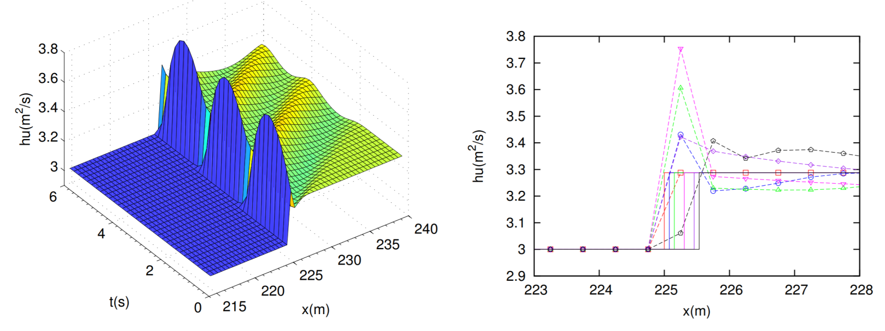
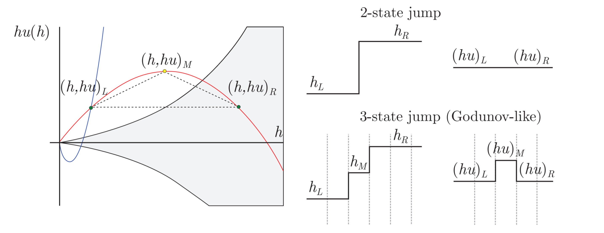
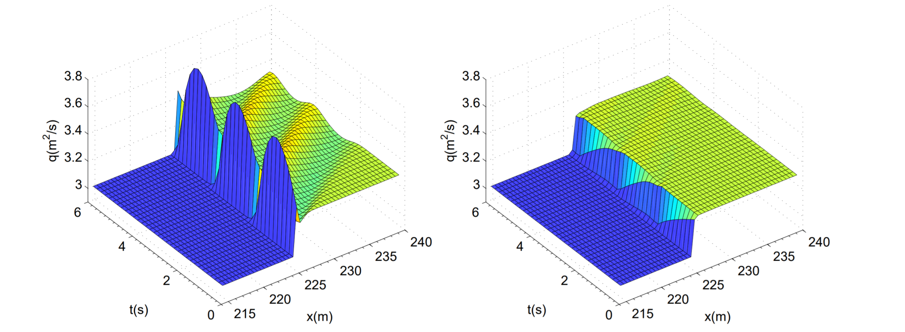

The work herein shown is part of my Doctoral Thesis [Accurate simulation of shallow flows using arbitrary order ADER schemes and overcoming numerical shockwave anomalies](https://zaguan.unizar.es/record/70795?ln=en), presented at University of Zaragoza on the 27th April 2018. More details can be found in [Navas-Montilla, 2019](https://www.sciencedirect.com/science/article/pii/S0021999118307496) and  [Navas-Montilla, 2017](https://www.sciencedirect.com/science/article/pii/S0021999117302589). 

### Numerical shockwave anomalies

From the early stages of CFD, the computation of shocks using Finite Volume methods has been a very challenging task as they often prompt the generation of numerical anomalies. Such anomalies lead to an incorrect and unstable representation of the discrete shock profile that may eventually ruin the whole solution. The two most widespread anomalies are the slowly-moving shock anomaly and the
carbuncle, which are deeply addressed in the literature in the framework of homogeneous problems, such as Euler equations. In this work, the presence of the aforementioned anomalies is studied in the framework of the 1D and 2D SWE and novel solvers that effectively reduce both anomalies, even in cases where source terms dominate the solution, are presented. 

#### The slowly-moving shock anomaly

The slowly-moving shock anomaly was first investigated by Roberts, who defined it as numerical noise generated in the discrete shock transition layer which is transported downstream. Such noise is also referred to as post-shock oscillations (Figure 1). 

<figure style="text-align: center;">
  
  <figcaption>Figure 1. Slowly-moving shock anomaly.</figcaption>
</figure>

The slowly-moving shock problem is related to nonlinearities of the Hugoniot curves, which in the case of the SWE, are found in those branches of the Hugoniot locus related to hydraulic jump-type solutions.  Generally, physical shockwaves have a finite width, determined by the physical dissipation processes taking place within the shock. This is the case of hydraulic jumps, whose width has to do with the turbulent transition between the supercritical, more energetic region and the subcritical region. Contrary to this, shocks are mathematically represented by pure discontinuities in hyperbolic systems. On the other hand, when considering the numerical resolution of shockwaves using the FV method, a numerical width, different from the physical width, is enforced by the grid size. This leads to intermediate states which cannot be given a direct physical interpretation, as the shock width is not controlled by the physical dissipation mechanisms within the shock but only by the grid size. Such states cannot be removed even when refining the grid, hence numerical schemes must be designed in a particular way to overcome such flaw. In Figure 2, the exact and the 3-state (with intermediate cell containing the shock) shock solution is depicted.

<figure style="text-align: center;">
  
  <figcaption>Figure 2. Exact and numerical representation of a shock wave for the SWE.</figcaption>
</figure>

In [Navas-Montilla, 2017](https://www.sciencedirect.com/science/article/pii/S0021999117302589) a modification of the traditional ARoe solver, using the flux-extrapolation technique (called flux function A) presented by Dr. Daniel W. Zaide in [his Doctoral Thesis](http://www.danielzaide.com/PDF/zaide_thesis.pdf), is proposed. This novel solver, which represents the extension of the method by D.W. Zaide for those problems with source terms, is able to provide a significant reduction of the spurious spike in presence of hydraulic jumps. In [Navas-Montilla, 2019](https://www.sciencedirect.com/science/article/pii/S0021999118307496), this solver was extended to 2D and improved to completely eliminate the spike in steady solutions.

Figure 3 shows a space-time representation of a slowly-moving hydraulic jump computed by the traditional Roe method and the proposed spike-reducing solver. It is evidenced that the spike in the discharge is successfully reduced.

<figure style="text-align: center;">
  
  <figcaption>Figure 2. Space-time representation of a slowly-moving hydraulic jump when using the traditional Roe method and the proposed spike-reducing solver.</figcaption>
</figure>

