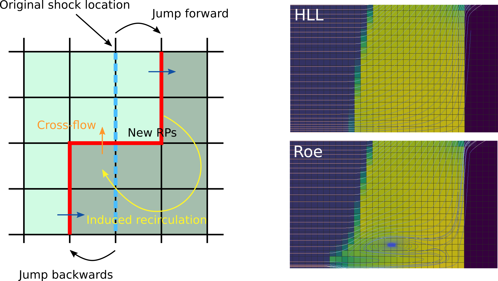

The work herein shown is part of my Doctoral Thesis [Accurate simulation of shallow flows using arbitrary order ADER schemes and overcoming numerical shockwave anomalies](https://zaguan.unizar.es/record/70795?ln=en), presented at University of Zaragoza on the 27th April 2018. More details can be found in [Navas-Montilla, 2019](https://www.sciencedirect.com/science/article/pii/S0021999118307496) and  [Navas-Montilla, 2017](https://www.sciencedirect.com/science/article/pii/S0021999117302589) (and references therein, which are ommited below). 

### Numerical shockwave anomalies

From the early stages of CFD, the computation of shocks using Finite Volume methods has been a very challenging task as they often prompt the generation of numerical anomalies. Such anomalies lead to an incorrect and unstable representation of the discrete shock profile that may eventually ruin the whole solution. The two most widespread anomalies are the slowly-moving shock anomaly and the carbuncle, which are deeply addressed in the literature in the framework of homogeneous problems, such as Euler equations. In this work, the presence of the aforementioned anomalies is studied in the framework of the 1D and 2D Shallow Water Equations (SWE) and novel solvers that effectively reduce both anomalies, even in cases where source terms dominate the solution, are presented. 

#### The slowly-moving shock anomaly

The slowly-moving shock anomaly was first investigated by [Roberts](https://www.sciencedirect.com/science/article/pii/002199919090200K), who defined it as numerical noise generated in the discrete shock transition layer which is transported downstream. Such noise is also referred to as post-shock oscillations (Figure 1). 

<figure style="text-align: center;">
  
  <figcaption>Figure 1. Slowly-moving shock anomaly. Space-time representation of the discharge across a hydraulic jump, using the SWE.</figcaption>
</figure>

The **slowly-moving shock problem** is related to nonlinearities of the Hugoniot curves, which in the case of the SWE, are found in those branches of the Hugoniot locus related to hydraulic jump-type solutions.  Generally, physical shockwaves have a finite width, determined by the physical dissipation processes taking place within the shock. This is the case of hydraulic jumps, whose width has to do with the turbulent transition between the supercritical, more energetic region and the subcritical region. Contrary to this, shocks are mathematically represented by pure discontinuities in hyperbolic systems. On the other hand, when considering the numerical resolution of shockwaves using the FV method, a numerical width, different from the physical width, is enforced by the grid size. This leads to intermediate states which cannot be given a direct physical interpretation, as the shock width is not controlled by the physical dissipation mechanisms within the shock but only by the grid size  [(Zaide,2012)](http://www.danielzaide.com/PDF/zaide_thesis.pdf). Such states cannot be removed **even when refining the grid**, hence numerical schemes must be designed in a particular way to overcome such flaw. In Figure 2, the exact and the 3-state (with intermediate cell containing the shock) shock solution is depicted.

<figure style="text-align: center;">
  
  <figcaption>Figure 2. Exact and numerical representation of a shock wave for the SWE.</figcaption>
</figure>

In [Navas-Montilla, 2017](https://www.sciencedirect.com/science/article/pii/S0021999117302589), an extension of the flux-extrapolation technique (called flux function A) presented by Dr. Daniel W. Zaide in [his Doctoral Thesis](http://www.danielzaide.com/PDF/zaide_thesis.pdf), is proposed. The novel solver, which is based on the ARoe solver, aims at the resolution of hyperbolic conservation laws with source terms. In the framework of the SWE, it proved to provide a significant reduction of the spurious spike in presence of hydraulic jumps. Figure 3 shows a space-time representation of a slowly-moving hydraulic jump computed by the traditional Roe method and the proposed spike-reducing solver. It is evidenced that the spike in the discharge is successfully reduced.

<figure style="text-align: center;">
  
  <figcaption>Figure 3. Space-time representation of a slowly-moving hydraulic jump when using the traditional Roe method and the proposed spike-reducing solver.</figcaption>
</figure>

In [Navas-Montilla, 2019](https://www.sciencedirect.com/science/article/pii/S0021999118307496), this solver was extended to 2D and improved to completely eliminate the spike in steady solutions.Figure 4 shows the numerical resolution of a 2D hydraulic jump in the form of a bow-shock around a solid body. It is observed that only when using the spike-reducing solver, the unphysical values along the shock contour are eliminated.

<figure style="text-align: center;">
  
  <figcaption>Figure 4. Steady hydraulic jump around a solid body computed by the spike-reducing solver (top) and the traditional ARoe solver (bottom).</figcaption>
</figure>

#### The carbuncle

When computing 2D strong shocks, such as hydraulic jumps, a numerical instability in the discrete shock profile may appear. This is known as the **carbuncle** and was first observed in simulations of air flow around blunt bodies by [Peery and Imlay ](https://arc.aiaa.org/doi/abs/10.2514/6.1988-2904). The study of the Carbuncle was initially developed in the framework of Euler equations. For such equations, the most common example is the simulation of a hypersonic flow around an infinite cylinder on a structured grid. The presence of the cylinder creates a dettached bow shock around it, where the carbuncle is prone to appear. It was observed that a disturbance in the shock profile appears in the center of the domain, where the shock is better aligned with the grid.

At present, the explanation for the carbuncle is still not clear. Previous literature suggest that the occurence of the carbuncle has to do with the Cartesian-like representation of purely 2D shock profiles. A soft curvature in the analytical shock profile is represented by a jump of the discrete shock profile in one cell column. Moreover, an stability analysis of the solution suggest that the position of the shock is unstable and might jump by up to two cells in any direction. When such jump happens, a cross flow is triggered due to the presence of a discrete shock profile in the x direction, as depicted in Figure 5 (left). The cross flow generates a recirculation downstream, which enhances the spreading of the shock profile and eventually originates a carbuncle-like structure, as depicted in Figure 5 (right). Only when using a Riemann solver that adds sufficient numerical diffusion to the contact wave, the carbuncle does not appear (e.g. the HLL solver).

<figure style="text-align: center;">
  
  <figcaption>Figure 5. Sketch of the intrinsic mechanisms behind the carbuncle. Adapted from <a href="https://www.researchgate.net/publication/263845832_The_Carbuncle_Phenomenon_in_Shallow_Water_Simulations">Bader and Kemm</a>.</figcaption>
</figure>

In [Navas-Montilla, 2019](https://www.sciencedirect.com/science/article/pii/S0021999118307496), the spike-reducing solver is enhanced using a wave-smearing technique in the resolution of the contact wave (increasing the numerical diffusion across it), which reduces the appearance of the Carbuncle when computing supercritical shocks. The numerical resolution of a hydraulic jump over a smoothly-varying bed by means of the traditional ARoe and HLLS solvers, as well as the spike-reducing carbuncle-free solvers, is presented in Figure 6.

<figure style="text-align: center;">
  
  <figcaption>Figure 6. Resolution of a hydraulic jump over a smoothly-varying bed, computed by different solvers.</figcaption>
</figure>

[BACK TO MAIN PAGE](https://github.com/navasmontilla/site)
