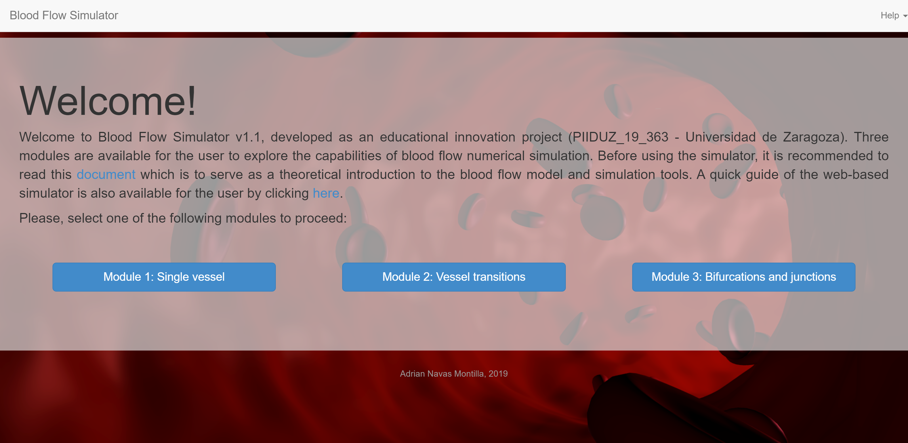

### Blood Flow simulation

#### Cloud-based academic blood flow simulator

I developed a cloud-based flow simulation tool with educational purposes. This is freely accessible at [Bloodflowmodel.net](https://www.bloodflowmodel.net). This work was funded by Gobierno de Aragon-FEDER (T32_17R. Mecánica de Fluidos Computacional) in the framework of the educational innovation project PIIDUZ_19_363 of the University of Zaragoza. This website offers a new user-friendly graphical user interface that allows the user to experiment with blood flow simulation. 

<figure style="text-align: center;">
  
  <figcaption>Figure 1. Snapshot of Bloodflowmodel main menu.</figcaption>
</figure>

#### Numerical resolution of blood flow using a 1D model with a viscoelastic fluid-structure closure formulation

#### Numerical resolution of blood flow using a 1D model with a viscoelastic fluid-structure closure formulation

The work herein shown has developed in colaboration with J. Murillo, G. Bertaglia, V. Caleffi and A. Valiani from the University of Ferrara. The experimental validation of the methods has been carried out in collaboration with M. I. Monge from the Critical Care Unit at SAS-Hospital de Jerez de la Frontera.

**The model**

The slowly-moving shock anomaly was first investigated by [Roberts](https://www.sciencedirect.com/science/article/pii/002199919090200K), who defined it as numerical noise generated in the discrete shock transition layer which is transported downstream. Such noise is also referred to as post-shock oscillations (Figure 1). 

<figure style="text-align: center;">
  
  <figcaption>Figure 1. Slowly-moving shock anomaly. Space-time representation of the discharge across a hydraulic jump, using the SWE.</figcaption>
</figure>

**In-vivo measurements**

**Post-processing of the results**
