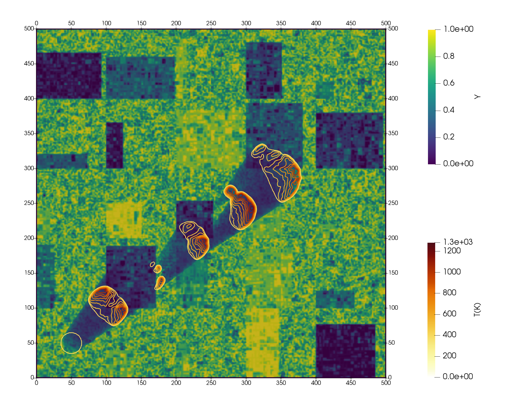
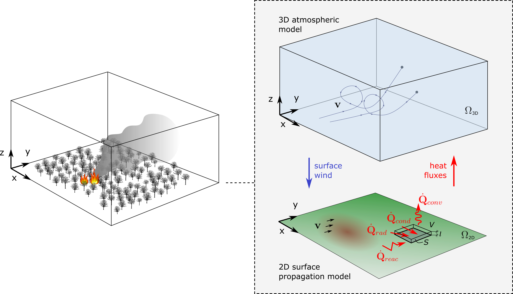

## SIMULATION AND DYNAMICAL ANALYSIS OF WILDFIRE PROPAGATION USING HIGH RESOLUTION COMPUTATIONAL TOOLS (FIREDYN)

Funding institution: Ministerio de Ciencia, Innovación y Universidades (Agencia Estatal de Investigación) - Cofinanciado Unión Europea

Date: 01/09/2023 - 31/08/2025

PI: Adrián Navas Montilla

Participants:

- Pablo Díaz Benito (Applied Mathematics, University of Zaragoza)
- Ilhan Özgen-Xian (Theoretical Ecohydrology Lab, TU Braunschweig)
- Cordula Reisch (Institute for Partial Differential Equations, TU Braunschweig)

<figure style="text-align: center;">
  
</figure>

## Abstract

This is a proposal for a non-oriented research project in the area of mathematical modelling, simulation and dynamical analysis of environmental flows. Our goal is to develop mathematical and computational tools to analyze and simulate wildfire events, that improve the understanding of the non-linear dynamical processes involved both in the **surface propagation** and in the **atmospheric dynamics** of a wildfire. The scientific results of this research include novel mathematical, numerical and computational tools, e.g. the derivation of novel high-order numerical solvers, which can be of interest to a broad public working on computational fluid dynamics, earth-system modelling, applied mathematics and dynamical system analysis.

<figure style="text-align: center;">
  
  <figcaption>Figure 1. Outcome of the surface propagation model, showing the propagation of the fire at different times.</figcaption>
</figure>

## Objectives

The main objective of this project is the **development of mathematical and computational tools for the analysis and simulation of wildfire events that improve the understanding of the non-linear dynamical processes involved both in the surface propagation and in the atmospheric dynamics, throwing light to their interaction in a context of climate change**. We will consider physically based mathematical models, based on systems partial differential equations, which describe the evolution in space and time of the concentration and temperature of biomass, as well as the air velocity, pressure, density and temperature. To achieve the main objective stated above, we have identified the following specific objectives:
- **Mathematical modelling of wildfires**: We aim to formulate a simplified model that retains all the features required to reproduce the dynamical behavior of surface propagation and its interaction with the atmosphere in a two-way coupling manner. The surface propagation model will account for the advection, conduction, radiation and natural convection fluxes, as well as for the combustion processes in a simplified manner. The atmospheric model will be a non-hydrostatic model derived from the fundamental principles of conservation of mass, momentum, and energy in the mixture of air and combustion products. A coupling strategy will be proposed.
- **Numerical simulation of wildfires**: We aim to design and implement a numerical scheme for the discretization of the models which is both accurate and robust in space and time. Non-oscillatory high order reconstruction methods will be considered for the discretization of the equations, and special attention will be paid to the integration in time of the source terms, which may become very stiff. The scheme will be implemented using High Performance Computing techniques that allow parallel simulation and will increase the computational efficiency.
- **Dynamical analysis of wildfires and study of the interplay between the main drivers of the spread**: This objective focuses on the analysis of the model equations, as well as the relation between the problem variables, the modeled mechanisms, external conditions and parameters, to better understand the dynamics of the processes and the interplay between the main drivers of the fire spread. Such drivers interact in a  non-linear manner and may change the solution behavior qualitatively.

<figure style="text-align: center;">
  
  <figcaption>Figure 2. Surface propagation model and atmospheric model, and their coupling.</figcaption>
</figure>

## Outcome

### Publications in high-impact factor international journals
- Navas-Montilla, A., Reisch, C., Diaz, P., & Özgen-Xian, I. (2024). Modeling wildfire dynamics through a physics-based approach incorporating fuel moisture and landscape heterogeneity. arXiv preprint [arXiv:2412.04517](https://arxiv.org/abs/2412.04517). Under review.
- Navas-Montilla, A., Guallart, J., Solán-Fustero, P., & García-Navarro, P. (2024). Exploring the potential of TENO and WENO schemes for simulating under-resolved turbulent flows in the atmosphere using Euler equations. Computers & Fluids, 280, 106349. Open Access:  [https://doi.org/10.1016/j.compfluid.2024.106349](https://doi.org/10.1016/j.compfluid.2024.106349)
- Reisch, C., Navas-Montilla, A., & Özgen-Xian, I. (2024). Analytical and numerical insights into wildfire dynamics: Exploring the advection–diffusion–reaction model. Computers & Mathematics with Applications, 158, 179-198. Open Access: [https://doi.org/10.1016/j.camwa.2024.01.024](https://doi.org/10.1016/j.camwa.2024.01.024)

### Open source software and data

- Navas-Montilla, A, CÆLUM: An academic High-Order Finite-Volume solver for the compressible Euler equations and related models. Github repository: [https://github.com/navasmontilla/CAELUM](https://github.com/navasmontilla/CAELUM). 
- Research data: [https://github.com/navasmontilla/WildfireData_122024](https://github.com/navasmontilla/WildfireData_122024). 

### Congress participation

- Nieding, L., Reisch, C., Langemann, D., & Navas-Montilla, A. (2024). "Impact of topography and combustion functions on fire front propagation in an advection-diffusion-reaction model for wildfires". Conference paper for 11th Vienna International Conference on Mathematical Modelling.
- A. Navas-Montilla, Reisch, C., Diaz, P., & Özgen-Xian, I. "A physics-based wildfire propagation model incorporating wind, moisture and topography". NumAspYoung24 Conference, Ferrara, Italy. 18.12.2024.
- C. Reisch, A. Navas Montilla, I. Özgen, "Analytical and numerical investigation of an advection-diffusion-reaction wildfire model", Invited talk in the Seminar of Applied Mathematics, University of L'Aquila, Italy, 06.11.2024
- A. Navas-Montilla, Guallart, J., Solán-Fustero, P., Echeverribar, I., García-Navarro, P. “Evaluation of WENO and TENO schemes for the simulation of atmospheric flows” (oral). ECCOMAS2024, Lisboa, Portugal. 04.06.2024.
- A. Navas Montilla, C. Reisch, P. Díaz, I. Özgen, “Towards a physics-based ADR wildfire propagation model for heterogeneous lands” (oral) Workshop Interdisciplinary Research in Ecological and Mathematical Analysis of Wildfire Hazards, Braunschweig, Germany, 16.11.2023
- C. Reisch, A. Navas Montilla, I. Özgen, "Exploring an advection-diffusion-reaction wildfire model analytically and with simulations" (oral) Workshop Interdisciplinary Research in Ecological and Mathematical Analysis of Wildfire Hazards, Braunschweig, Germany, 16.11.2023
- C. Reisch, "Spatially heterogeneous reaction-diffusion equations arising from applications" ÖMG Tagung 2023, invited talk in the minisymposium: PDEs and Mathematical Biology, Graz, Austria, 21.09.2023.
- C. Reisch, "Spatial heterogeneity in reaction diffusion equations" (poster) Workshop: Modelling Diffusive Systems 2023: Theory & Biological Applications, ICMS, Edinburgh, Scotland, 11.09.2023.
