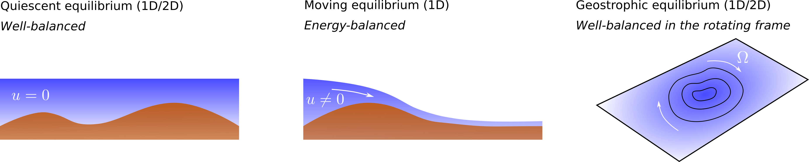

The work herein presented has been developed at the [Computational Hydraulics Group](http://ghc.unizar.es) at [Univerisity of Zaragoza](https://www.unizar.es/). Computational resources have been provided by [LIFTEC-CSIC](http://www.liftec.unizar-csic.es/es/). The validation of the computational tools has been done in colaboration with the [LCH-EPFL](https://lch.epfl.ch/).

This work is the result of my Doctoral Thesis [Accurate simulation of shallow flows using arbitrary order ADER schemes and overcoming numerical shockwave anomalies](https://zaguan.unizar.es/record/70795?ln=en), supervised by Dr. J. Murillo and presented at University of Zaragoza on the 27th April 2018. In the following sections, the most relevant aspects of this thesis are brought out and supplementary multimedia content is presented.

### Generation of arbitrary order augmented schemes for hyperbolic problems with source terms: application to the SWE

We aim at the generation of fully-discrete arbitrary order numerical schemes, based on the WENO spatial reconstruction and ADER time-stepping technique, with application to hyperbolic problems with source terms. The proposed schemes are based on augmented Riemann solvers that include the contribution of source terms in the definition of the Riemann problem, allowing the presevation of equilibrium states with machine precision.

We consider the application of the aforementioned methods to the SWE with bed elevation, friction and Coriolis. In presence of such sources, the relevant equilibrium states are (see Figure 3):

- Quiescent equilibrium (well-balanced property).
- Moving water equilibrium (energy-balanced property).
- Geostrophic equilibrium (well-balanced property in the rotating frame).

<figure style="text-align: center;">
  
  <figcaption>Figure 3. Relevant equilibrium states for the SWE.</figcaption>
</figure>

Furthermore, additional dissipation effects are accounted for by including turbulence models using the Boussinesq approximation. The RANS and URANS approaches are considered and algebraic as well as 1 and 2 equation turbulence models are used.

#### The WENO AR/ARL-ADER method in 1D: well-balanced and energy-balanced simulation of the SWE with bed variation

The first stage of the project was the development of the mathematical framework for the resolution of hyperbolic conservation laws with geometric source terms with arbitrary order of accuracy using WENO-ADER schemes. A new family of solvers for the Derivative Riemann problem are proposed, using the augmented-solver methodology and based on previous work from Toro, Castro and Titarev. The novelty of the proposed methods is:

- For transient cases, they converge with arbitrary order to the analytical solution. The numerical solution to a complete set of RPs, including solutions in the resonant regime, are presented in [Navas-Montilla, 2015](https://www.sciencedirect.com/science/article/pii/S0021999115001217) and [Navas-Montilla, 2016](https://www.sciencedirect.com/science/article/pii/S0021999116301024) (see Figure 4).

- For steady cases, they provide the exact solution with independence of the grid thanks to the energy-balanced property.

<figure style="text-align: center;">
  
  <figcaption>Figure 4. Resolution of RPs including strong bed variations.</figcaption>
</figure>

Details of the methods and more results can be found in [Navas-Montilla, 2015](https://www.sciencedirect.com/science/article/pii/S0021999115001217) and [Navas-Montilla, 2016](https://www.sciencedirect.com/science/article/pii/S0021999116301024).

#### The WENO ARL-ADER method in 2D: well-balanced simulation of the SWE with bed variation, friction and Coriolis

The numerical schemes in the previous section were then extended to the resolution of the 2D SWE with geometric source term and their application to other shallow water models involving non-geometric sources was  explored. The following issues are highlighted:

- The proposed scheme offers an arbitrary order resolution of the 2D SWE with bed elevation and friction ensuring the well-balanced property. The application of the scheme to the resolution of a complex flow pattern around a solid obstacle is shown in Figure 5.

<figure style="text-align: center;">
  
  <figcaption>Figure 5. Numerical resolution of the reflection wave pattern generated in a subcritical free surface flow
around a square cylinder, provided by a 3rd order scheme (right) and 1st order scheme (left). <a href="https://www.youtube.com/watch?v=M7ep81gngow">Watch video</a>. </figcaption>
</figure>

- The proposed scheme allows to compute the advection of solutes with arbitrary order of accuracy, a shown in Figure 6. The scheme can be coupled with diffusion-reaction terms for the solutes, with application to industrial processes in water treatment plants.

<figure style="text-align: center;">
  
  <figcaption>Figure 6. Numerical simulation of the transport of a passive scalar quantity within a complex flow pattern using a 3rd order scheme (half top) and 1st order scheme (half bottom). <a href="https://www.youtube.com/watch?v=M7ep81gngow">Watch video</a>. </figcaption>
</figure>

- The scheme is applied to the resolution of the SWE in the rotating frame (including Coriolis). In  [Navas-Montilla, 2018](https://www.sciencedirect.com/science/article/pii/S0021999118304170), the results for the [benchmark of the propagation of  equatorial Rossby solitons](https://marine.rutgers.edu/po/index.php?model=test-problems&title=soliton&page=metrics) are presented and the relative errors for the amplitude and celerity of the soliton are kept below 2% ([Watch video](https://www.youtube.com/watch?v=-Dye0LG8-Ds)). The performance of the model is also assessed for the resolution of an anticyclonic eddy in the beta plane ([Watch video](https://www.youtube.com/watch?v=dGxyId1_Pk4)).

- The proposed methods offer a remarkable gain in computational efficiency when applied to 2D shallow water scenarios with source terms. Figure 7 shows the numerical error vs. CPU time (single-threaded/serial execution) and wall time (parallel execution in 24 threads implemented using the OpenMP paradigm) for the resolution of an smooth non-equilibrium Gaussian water surface over a smooth bottom topography ([Navas-Montilla, 2018](https://www.sciencedirect.com/science/article/pii/S0021999118304170)). The numerical results evidence that the 3-rd order scheme is able to provide the same level of accuracy than a 1-st order scheme requiring a 65 times shorter computational time, for an error of around 1.e-4. It is worth noting that this gain is increased when seeking lower errors. Furthermore, the plots also show that the paralellization of the code using OpenMP allows a significant speed-up.

<figure style="text-align: center;">
  
  <figcaption>Figure 7. Numerical error vs. CPU and wall time, showing the achieved speed-up.</figcaption>
</figure>

- As the order is increased, the numerical diffusion is strongly reduced and the proposed scheme is able to reproduce a larger extent of the kinetic energy cascade for 2D turbulence. Figures 8 and 9 show the numerical resolution of  double shear layer, which is initially perturbed in the transverse direction. Due to the inherent instability (Kelvin-Helmholtz instability) of the flow across the shear layer, any initial perturbation is amplified and evolves into a hydrodynamic two-dimensional turbulence. The vortices interact to each other and are combined to form bigger vortices. The mass exchange across the layers is governed by such turbulent pattern and only very high order numerical schemes, that produce low dissipative solutions, can provide trustworthy predictions of such process in an affordable time. In [Navas-Montilla, 2018](https://www.sciencedirect.com/science/article/pii/S0309170819309194), the performance of the  3-rd order ARL-ADER and HLLS-ADER schemes for the resolution of diffusive and turbulent shear layers is assessed.

<figure style="text-align: center;">
  
  <figcaption>Figure 8. Numerical simulation of a double shear layer. Initial condition (left) and solution after t=5 seconds (right), showing the water surface elevation and the vorticity field. </figcaption>
</figure>

<figure style="text-align: center;">
  
  <figcaption>Figure 9. Numerical simulation of a double shear layer using a 1st, 3rd and 5th order schemes. Vorticity field (top) and 2D energy cascade (bottom).</figcaption>
</figure>

Watch the following videos for more examples: 

   

Details of the methods and more results can be found in [Navas-Montilla, 2018](https://www.sciencedirect.com/science/article/pii/S0021999118304170) 

### URANS simulation of shallow flows using the WENO ARL-ADER method for the SWE

The proposed scheme offers a very low numerical dissipation, allowing the computation of small turbulent structures and the reproduction of the theoretical energy cascade as the grid is refined. However, the mathematical model considers a 2D depth averaged flow, while turbulence is, in essence, three dimensional. Therefore, extra dissipation terms must be included to account for the small scale turbulent dissipation that the model cannot resolve. 

In shallow flows, there is a coexistence of small-scale 3D turbulence, mainly generated by the friction on the bottom, and large-scale 2D turbulence, generated by horizontal gradients. The proposed model uses a turbulence model to account for the effects of the small-scale turbulence and resolves the large-scale 2D vortices. This approach is often called depth averaged URANS simulation or depth averaged LES simulation. A representation of the typical energy cascade in shallow flows is presented in Figure 10.

<figure style="text-align: center;">
  
  <figcaption>Figure 10. Typical energy cascade in shallow flows. 2D and 3D turbulence appear at different length scales.</figcaption>
</figure>

Turbulence modelling is of practical application when simulating the flow interaction with solid obstacles such as bridge piers and groynes, or even with strong variations in the bed elevation and bed friction. 

#### Simulation of the flow over a submerged conical island

[This test case](http://coastal.usc.edu/currents_workshop/problems/prob1.html) is a benchmark for tsunami simulation models and was introduced with this purpose for the first time at the National Tsunami Hazard Mitigation Program (NTHMP) workshop (Portland, 2015). It consists of a shallow flow over a small-slope submerged island. The aim of this benchmark is to test the model's ability to generate a separation region and the resulting oscillatory wake for an idealized and simplified case.

<figure style="text-align: center;">
  
  <figcaption>Figure 11. Numerical simulation of a shallow water flow over a submerged conical island <a href="https://www.youtube.com/watch?v=J3epKVZyX-o">(watch video)</a>.</figcaption>
</figure>

Figure 11 shows a snapshot of simulated tracer concentration distribution where the von-Karman vortex street can be observed. Only when including a suitable calibration of the friction coefficient and the turbulence model, the velocities in the wake are properly predicted and there is a stable periodicity in the shedding of von-Karman vortices. Figure 12 displays a comparison between numerical and experimental velocities in the wake region.  The detailed description of the simulation of this experiment is described in [Navas-Montilla, 2019](https://polipapers.upv.es/index.php/IA/article/view/12169).

<figure style="text-align: center;">
  
  <figcaption>Figure 12. Experimental (dots) and numerical velocities in the wake of the island. Solution without turbulence model (light blue), with turbulence model with low diffusion (blue) and with optimal calibration (purple). <a href="https://www.youtube.com/watch?v=J3epKVZyX-o">(Watch video)</a>.</figcaption>
</figure>

#### Application of the model to a practical problem of environmental relevance: river restoration

In the last decades, riverine and coastal habitats have degenerated because of anthropogenic activities. Nowadays, the scientific community is making a big effort to design novel approaches to recover biodiversity in such ecosystems. The utilization of fast and reliable predictive tools will suppose a breakthrough in this field as they will be able to plan efficient strategies based on the predicted quantitative variables. 

Channels with lateral cavities are commonly used for river restoration purposes as the presence of cavities enhances fine sediment trapping. The flow in these channels, far from being simple, involves the presence of steady seiching waves produced by the coupling between the instability of the separated turbulent layer along the opening of the cavities and a gravity standing wave within the cavities. Such coupling is associated with large-scale coherent vortical structures in the unstable shear layer and periodic oscillations of the free surface within the cavity. The complexity of such flow configuration challenges the prediction capability of simulation models. 

Detailed results of the application of the proposed schemes to the simulation of channels with lateral cavities can be found in the following article [Navas-Montilla, 2019](https://doi.org/10.1016/j.jcp.2019.06.037), done in colaboration with [C. Juez](http://www.upm.es/observatorio/vi/index.jsp?pageac=investigador.jsp&idInvestigador=33249) (UPM), [M. J. Franca](https://www.un-ihe.org/m%C3%A1rio-franca) (UN-IHE Delft) and [J. Murillo](https://ctmyf.unizar.es/personal/javier-antonio-murillo-castarlenas) (Unizar). An animation of the results can be watched  [here](https://www.youtube.com/watch?v=CreVrgijOSA).

<figure style="text-align: center;">
  
  <figcaption>Figure 13. Configuration of a channel with lateral cavities.</figcaption>
</figure>

<figure style="text-align: center;">
  
  <figcaption>Figure 14. Experimental and computed water surface elevation evolution in time at points E3, E4 and E5 without (left) and with turbulence model (right).</figcaption>
</figure>

Watch the following videos for more examples: 

  
